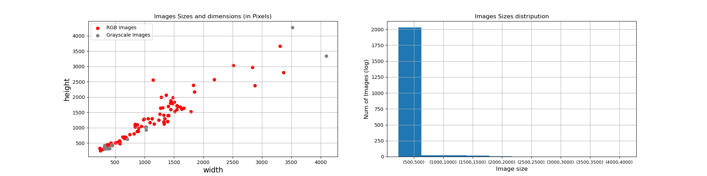
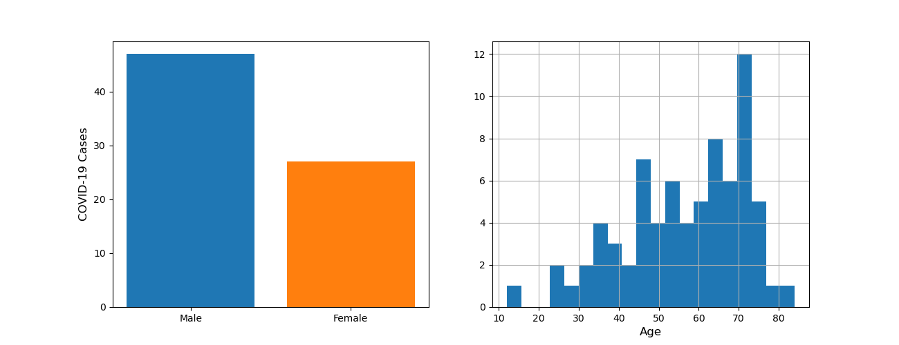
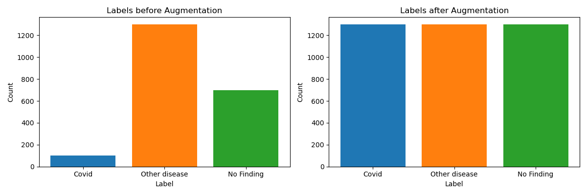

# Lungs-X-Ray-Classification
<h3>Dataset analysis</h3>
Dataset contains Chest Xray images from <a href=https://stanfordmlgroup.github.io/competitions/chexpert/>CheXpert</a>
with 2100 observation including 100 Covid-19 xray images.
The Task is Multi class Classification namely Covid-19, other disease or No finding.
Therefore, we summarize the data into 3 classes. The CSV file is structured as followed:
<table>
<th><td> Column </td> </th>
<tr><td>0 </td><td>File                       </td></tr>
<tr><td>1 </td><td>Age                        </td></tr>
<tr><td>2 </td><td>Sex                        </td></tr>
<tr><td>3 </td><td>No Finding                 </td></tr>
<tr><td>4 </td><td>Covid                      </td></tr>
<tr><td>5 </td><td>Enlarged Cardiomediastinum </td></tr>
<tr><td>6 </td><td>Cardiomegaly               </td></tr>
<tr><td>7 </td><td>Lung Opacity               </td></tr>
<tr><td>8 </td><td>Lung Lesion                </td></tr>
<tr><td>9 </td><td>Edema                      </td></tr>
<tr><td>10</td><td>Consolidation              </td></tr>
<tr><td>11</td><td>Pneumonia                  </td></tr>
<tr><td>12</td><td>Atelectasis                </td></tr>
<tr><td>13</td><td>Pneumothorax               </td></tr>
<tr><td>14</td><td>Pleural Effusion           </td></tr>
<tr><td>15</td><td>Pleural Other              </td></tr>
<tr><td>16</td><td>Fracture                   </td></tr>
<tr><td>17</td><td>Support Devices            </td></tr>
</table>

Also the dataset consists of grayscale and RGB images with different image sizes, where there is 92 the RGB images 
and 2008 Grayscale images.

<h3>Features Correlations with Covid-19</h3>
There are some features are correlated with Covid-19 as showen in the following:  

<h3>Perpetration of Train data</h3>
Firstly, we apply histogram equalization for all training images. For rgb images, we extract a grayscale image. Then, the images are scaled uniformly to (384, 384)
The Observations of the Dataset are quietly unbalanced, especially for the class covid-19.
After performing Offline Data-Augmentation we obtained 1300 observation for each class. 
Data-Augmentation includes flipping, shearing, image, noise and increase/decrease brightness.
